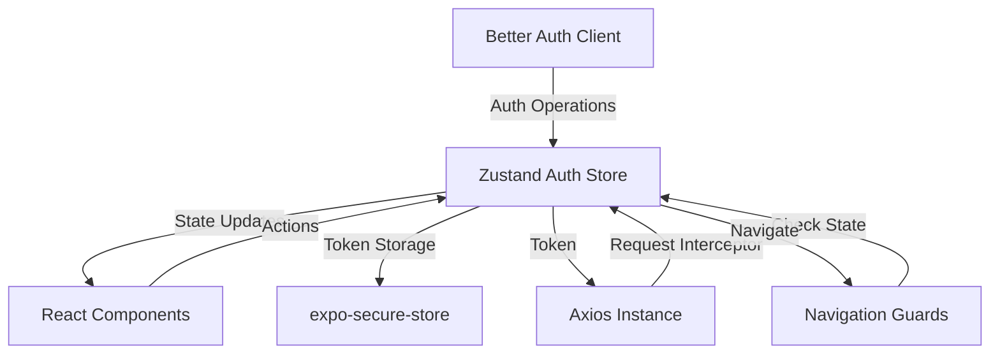

# Expo Authorization Flow Refactor

## Architecture Overview

The refactor will create a clean separation between Better Auth (backend integration) and application state management (Zustand), eliminating useEffect dependencies and implementing pure logic-based navigation guards.

## Implementation Steps

### 1. Install Dependencies

Add required packages:

- `zustand` - State management
- `axios` - HTTP client with interceptors
- `@tanstack/react-query` (optional) - For API state management if needed

### 2. Create Zustand Auth Store

**File: `stores/auth-store.ts`**Create a Zustand store that:

- Wraps Better Auth client operations
- Manages auth state synchronously (user, isAuthenticated, isLoading)
- Provides actions: `login`, `logout`, `checkAuth`, `refreshToken`
- Stores tokens in SecureStore within action handlers (not effects)
- Uses lazy initialization for initial auth check
- Implements token refresh logic as pure async functions

Key patterns:

- No useEffect in store
- All async operations return promises
- State updates are synchronous after async operations complete
- Token storage happens in action handlers, not automatically

### 3. Create API Client with Interceptors

**File: `lib/api-client.ts`**Create axios instance with:

- Request interceptor: Reads token from Zustand store (synchronous read)
- Response interceptor: Handles 401/403 with token refresh
- Request queue pattern for pending requests during token refresh
- Automatic retry logic for failed requests after refresh
- Base URL configuration from environment

Key patterns:

- Token injection happens in interceptor (reads from store)
- Refresh logic in interceptor, not components
- Queue pattern prevents duplicate refresh calls
- All API calls use this client instance

### 4. Refactor Navigation Guards

**File: `lib/navigation-guards.ts`**Create navigation guard utilities:

- `checkAuthBeforeNavigate()` - Pure function that checks store state
- `getInitialRoute()` - Determines initial route based on auth state
- `shouldAllowNavigation()` - Validates navigation attempts

**File: `app/_layout.tsx`**Update root layout to:

- Use linking configuration for initial route determination
- Implement navigation state listener for auth boundary enforcement
- Remove any useEffect hooks
- Use Zustand store for auth state checks

**File: `app/(auth)/_layout.tsx` and `app/(home)/_layout.tsx`**Add layout-level guards:

- Use `useFocusEffect` (minimal, only for UI updates)
- Check auth state from store before rendering
- Redirect logic in navigation listeners, not effects

### 5. Refactor Components

**Remove useEffect patterns from:**

- `app/(auth)/sign-in.tsx` - Use store actions directly in handlers
- `app/(auth)/sign-up.tsx` - Use store actions directly in handlers
- `app/(home)/index.tsx` - Read from store, no session hooks
- `app/(home)/profile.tsx` - Read from store, no session hooks
- All other auth-related components

**Pattern changes:**

- Replace `authClient.useSession()` with `useAuthStore((state) => state.user)`
- Replace `authClient.signIn.email()` with `useAuthStore.getState().login()`
- Remove all `useEffect(() => { checkAuth() }, [])` patterns
- Navigation happens in action handlers, not effects

### 6. Update Better Auth Integration

**File: `lib/auth/client.ts`**Keep Better Auth client but:

- Remove direct usage in components
- Only use in Zustand store actions
- Maintain SecureStore configuration

**File: `stores/auth-store.ts`**Wrap Better Auth operations:

- `login()` action calls `authClient.signIn.email()` then updates store
- `logout()` action calls `authClient.signOut()` then clears store
- `checkAuth()` action calls `authClient.useSession()` data, updates store
- `refreshToken()` handles token refresh if needed

### 7. Implement Token Management

**File: `lib/token-manager.ts`**Create token management utilities:

- `storeToken()` - Stores token in SecureStore (called from login action)